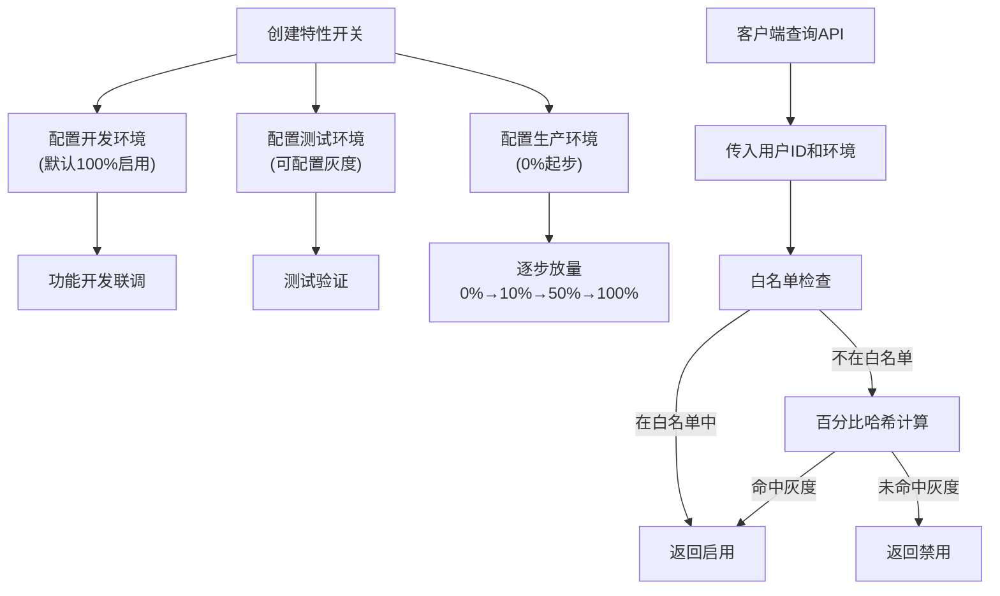

## 1. 产品概述

灰度发布与特性开关管理平台，用于控制功能的渐进式发布和精细化管理。解决传统全量发布风险高、回滚困难的问题，支持按百分比灰度、用户白名单、多环境隔离等能力。目标用户为开发团队、产品经理和运维人员。

核心价值：降低新功能上线风险，支持A/B测试，实现精细化用户运营，提升发布效率和系统稳定性。

## 2. 核心功能

### 2.1 用户角色

| 角色 | 登录方式 | 核心权限 |
|------|----------|----------|
| 管理员 | API密钥认证 | 特性开关全生命周期管理、环境配置、查看历史记录 |
| 开发者 | API密钥认证 | 创建/修改特性开关、配置灰度策略 |
| 客户端应用 | API密钥认证 | 查询特性开关状态（只读） |

### 2.2 功能模块

1. **特性开关管理**：创建、编辑、删除、启用/禁用特性开关
2. **灰度发布策略**：百分比灰度、用户ID白名单
3. **多环境管理**：开发/测试/生产环境独立配置
4. **客户端查询API**：实时查询用户可见的特性状态
5. **Dashboard仪表盘**：特性总览、灰度比例可视化
6. **变更历史记录**：所有操作的审计追踪

### 2.3 页面详情

| 页面名称 | 模块名称 | 功能描述 |
|----------|----------|----------|
| Dashboard首页 | 特性概览卡片 | 显示总特性数、各环境启用数、灰度中特性数 |
| Dashboard首页 | 特性列表 | 展示所有特性开关及其状态、灰度比例 |
| Dashboard首页 | 环境切换器 | 切换查看不同环境的配置 |
| 特性详情页 | 基本信息 | 特性名称、描述、创建时间 |
| 特性详情页 | 环境配置 | 各环境的启用状态、灰度比例、白名单配置 |
| 特性详情页 | 变更历史 | 该特性的所有修改记录 |
| 特性创建/编辑页 | 表单配置 | 输入特性信息、配置各环境参数 |
| 历史记录页 | 历史列表 | 全局搜索和查看所有操作记录 |

## 3. 核心流程

### 特性开关创建与发布流程

管理员创建特性开关，配置基本信息和各环境的灰度策略。开发环境默认全量启用，测试环境可配置小比例灰度，生产环境从0%开始逐步放量。客户端通过API查询特性状态，系统根据用户ID和灰度策略计算是否启用。

## 4. 用户界面设计

### 4.1 设计风格

采用现代简约的管理后台风格，强调数据清晰度和操作便捷性：
- 主色调：深蓝色系（#1e40af）代表专业和可信赖
- 辅助色：绿色（#059669）表示启用状态，橙色（#d97706）表示灰度中，红色（#dc2626）表示禁用
- 字体：使用清晰的无衬线字体，标题使用有设计感的展示字体
- 布局：左侧导航 + 顶部标题栏 + 主内容区的经典后台布局
- 卡片式设计，柔和阴影，清晰的状态标签

### 4.2 页面设计概述

| 页面名称 | 模块名称 | UI元素 |
|----------|----------|--------|
| Dashboard首页 | 概览卡片 | 渐变色背景、大号数字、状态图标、微动画 |
| Dashboard首页 | 特性列表 | 数据表格、状态标签、进度条展示灰度比例、快捷操作按钮 |
| Dashboard首页 | 环境切换 | Tab切换组件，带指示器动画 |
| 特性详情页 | 配置面板 | 分组表单、开关组件、滑块组件、标签输入框 |
| 特性详情页 | 历史记录 | 时间线组件、操作人、变更前后对比 |

### 4.3 响应式设计

采用桌面优先设计，适配不同屏幕尺寸：
- 桌面端（≥1024px）：完整的侧边栏导航 + 数据表格
- 平板端（768px-1023px）：可折叠侧边栏，保持表格完整展示
- 移动端（<768px）：底部Tab导航，卡片式列表替代表格，操作按钮简化

### 4.4 交互体验

- 页面加载时使用骨架屏占位，数据加载完成后平滑过渡
- 状态切换有过渡动画，开关切换有滑入效果
- 表格行hover高亮，操作按钮悬停有颜色变化和阴影
- 表单提交有loading状态，成功/失败有toast提示
