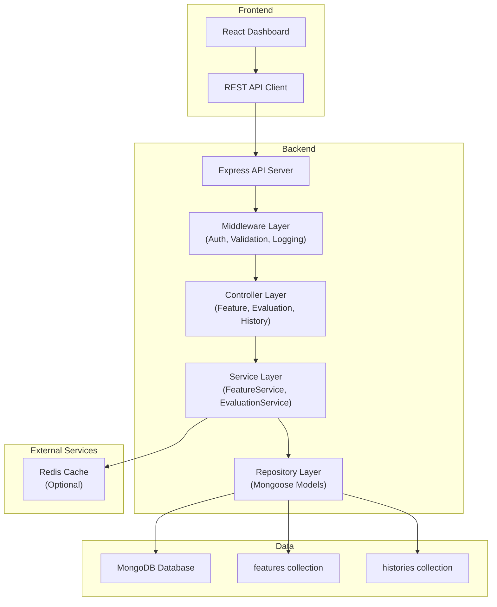
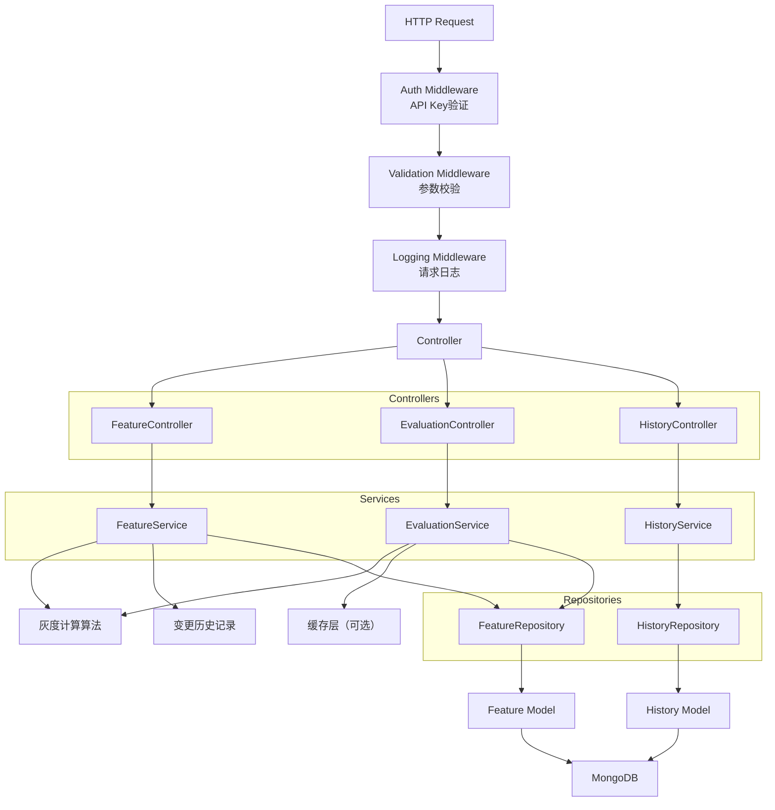
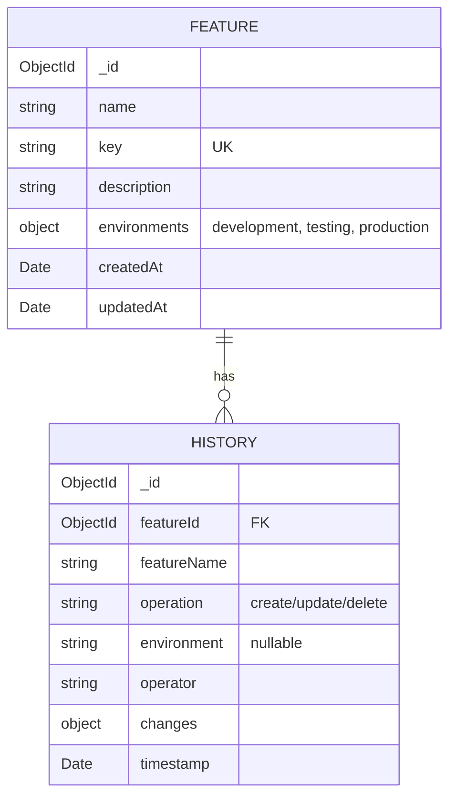

## 1. 架构设计



## 2. 技术栈描述

- **前端**：React@18 + TypeScript + Vite + TailwindCSS@3 + Zustand + React Router + Lucide React
- **后端**：Express@4 + TypeScript + Mongoose@7
- **数据库**：MongoDB（使用内存数据库或本地MongoDB）
- **初始化工具**：vite-init（react-express-ts模板）

## 3. 路由定义

| 路由 | 页面/用途 |
|------|----------|
| / | Dashboard首页 - 特性概览和列表 |
| /features/:id | 特性详情页 |
| /features/new | 创建新特性 |
| /features/:id/edit | 编辑特性 |
| /history | 全局变更历史 |

### API路由

| 方法 | 路由 | 用途 |
|------|------|------|
| GET | /api/features | 获取所有特性列表 |
| GET | /api/features/:id | 获取单个特性详情 |
| POST | /api/features | 创建新特性 |
| PUT | /api/features/:id | 更新特性 |
| DELETE | /api/features/:id | 删除特性 |
| GET | /api/features/:id/history | 获取特性变更历史 |
| GET | /api/evaluate | 客户端查询特性状态（带userId） |
| GET | /api/evaluate/batch | 批量查询多个特性状态 |
| GET | /api/history | 获取全局历史记录 |

## 4. API定义

### 数据类型定义

```typescript
// 环境类型
type Environment = 'development' | 'testing' | 'production';

// 特性开关状态
type FeatureStatus = 'active' | 'disabled' | 'gradual';

// 环境配置
interface EnvironmentConfig {
  enabled: boolean;
  rolloutPercentage: number; // 0-100
  whitelist: string[]; // 用户ID白名单
}

// 特性开关
interface Feature {
  id: string;
  name: string;
  key: string;
  description: string;
  createdAt: string;
  updatedAt: string;
  environments: Record<Environment, EnvironmentConfig>;
}

// 变更历史
interface HistoryRecord {
  id: string;
  featureId: string;
  featureName: string;
  operation: 'create' | 'update' | 'delete';
  environment?: Environment;
  operator: string;
  changes: Record<string, { old: any; new: any }>;
  timestamp: string;
}

// 评估请求
interface EvaluateRequest {
  featureKey?: string;
  featureKeys?: string[];
  userId: string;
  environment: Environment;
}

// 评估响应
interface EvaluateResponse {
  featureKey: string;
  enabled: boolean;
  reason: 'whitelist' | 'rollout' | 'disabled' | 'not-found';
}

// 创建/更新请求
interface FeatureRequest {
  name: string;
  key: string;
  description: string;
  environments: Record<Environment, Partial<EnvironmentConfig>>;
}
```

### 请求/响应示例

```typescript
// POST /api/features
// Request
{
  "name": "新用户引导流程",
  "key": "new_user_onboarding_v2",
  "description": "新版用户注册引导流程",
  "environments": {
    "development": { "enabled": true, "rolloutPercentage": 100, "whitelist": [] },
    "testing": { "enabled": true, "rolloutPercentage": 50, "whitelist": ["user123", "user456"] },
    "production": { "enabled": false, "rolloutPercentage": 0, "whitelist": [] }
  }
}

// GET /api/evaluate?featureKey=new_user_onboarding_v2&userId=user789&environment=production
// Response
{
  "featureKey": "new_user_onboarding_v2",
  "enabled": false,
  "reason": "disabled"
}

// GET /api/evaluate?featureKey=new_user_onboarding_v2&userId=user123&environment=testing
// Response
{
  "featureKey": "new_user_onboarding_v2",
  "enabled": true,
  "reason": "whitelist"
}
```

## 5. 服务器架构图



## 6. 数据模型

### 6.1 ER图



### 6.2 Mongoose Schema

```typescript
// Feature Model
const featureSchema = new mongoose.Schema({
  name: { type: String, required: true, trim: true },
  key: { type: String, required: true, unique: true, trim: true },
  description: { type: String, default: '' },
  environments: {
    development: {
      enabled: { type: Boolean, default: true },
      rolloutPercentage: { type: Number, default: 100, min: 0, max: 100 },
      whitelist: { type: [String], default: [] }
    },
    testing: {
      enabled: { type: Boolean, default: false },
      rolloutPercentage: { type: Number, default: 0, min: 0, max: 100 },
      whitelist: { type: [String], default: [] }
    },
    production: {
      enabled: { type: Boolean, default: false },
      rolloutPercentage: { type: Number, default: 0, min: 0, max: 100 },
      whitelist: { type: [String], default: [] }
    }
  }
}, { timestamps: true });

// History Model
const historySchema = new mongoose.Schema({
  featureId: { type: mongoose.Schema.Types.ObjectId, ref: 'Feature', required: true },
  featureName: { type: String, required: true },
  operation: { type: String, enum: ['create', 'update', 'delete'], required: true },
  environment: { type: String, enum: ['development', 'testing', 'production'] },
  operator: { type: String, default: 'system' },
  changes: { type: mongoose.Schema.Types.Mixed, default: {} },
  timestamp: { type: Date, default: Date.now }
});
```

### 6.3 灰度算法说明

**一致性哈希算法**（确保同一用户始终获得相同结果）：

```typescript
function isUserInRollout(userId: string, percentage: number, featureKey: string): boolean {
  const hash = crypto
    .createHash('md5')
    .update(`${featureKey}:${userId}`)
    .digest('hex');
  const hashValue = parseInt(hash.substring(0, 8), 16);
  const bucket = (hashValue % 100) + 1; // 1-100
  return bucket <= percentage;
}
```

**评估优先级**：
1. 如果环境未启用 → 返回 false
2. 如果用户在白名单中 → 返回 true
3. 如果灰度比例为 0 → 返回 false
4. 如果灰度比例为 100 → 返回 true
5. 使用一致性哈希计算用户是否在灰度范围内 → 返回结果
